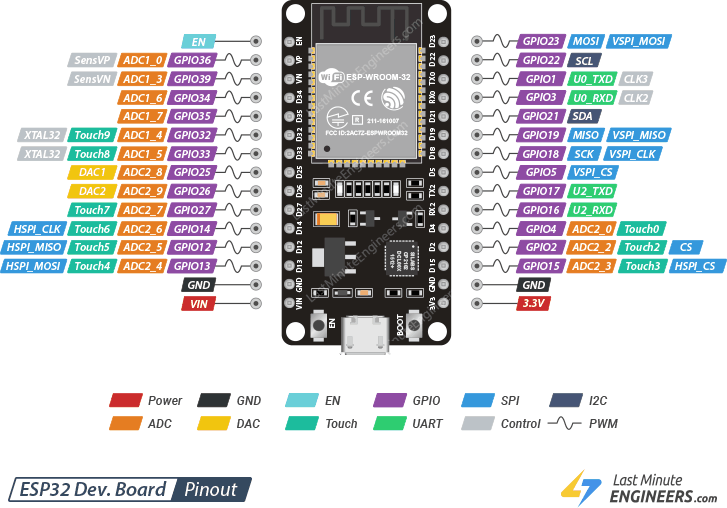
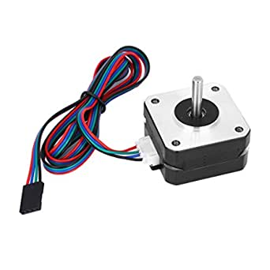
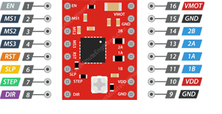
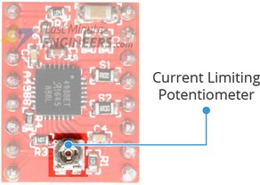
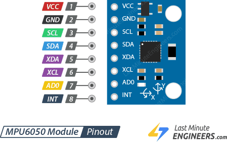

### Motor Drive

#### ESP32 Pinout

ESP32 is a low-cost microcontroller that uses low power and equipped with WiFi ability. The pin connections of ESP32 are shown in below. 

ESP32 will be located on top of the FPGA cap that you are given and will be controlling the motors via stepper motor drivers A4988 and gyroscope/ accelerometer MPU-6050 with I2C communication.

#### NEMA 17 Stepper Motor
NEMA 17 is a type of motor that will be used in this project. As balancing robot requires an accurate position control, a stepper motor is suitable for this task. NEMA 17 ia bipolar stepper motor that provides high torque with low noise and works with the 8-35V supply voltage. See the motor details in given motor datasheet. For the motor dimensions, please consider that you are given pancake type NEMA 17 motors which are more compact than standard size NEMA 17 motor.

#### Stepper Motor Driver (A4988)

The A4988 has two different power supply connections as below:
**VMOT and GND:** To power up the motor and it can go up to 35V.
**VDD and GND:** To power the sensor internal logic circuitry, and it can be between 3.3V to 5V.
**1A, 1B, 2A and 2B** output pins are for the motor connection. Our motor NEMA-17 is a bipolar stepper motor which comes 4 wires and are connected to 1A, 1B, 2A and 2B output pins.
Stepper motor driver requires to use a heatsink as excessive power dissipation may damage the IC. Therefore, you are given heatsink for the motor drivers A4988.
To enable the driver, **RST** pin should be connected to **SLEEP** pin.
**DIR** and **STEP** pins are input controls pins. STEP controls the microsteps of the motor and DIR controls the direction of motor rotation.

Before you run the motors, you must set the maximum current on the driver, so the current flow through the motor coils does not exceed the rated current.
You can set the current limit by adjusting the small trimmer potentiometer shown in below. 

After setting the current limit, you can finalise your connections and make your stepper motor ready to be plugged in your power supply. You are suggested to put a large 100μF capacitor between VMOT and GND to prevent large voltage spikes.

Sample Pin Connections are given below.

#### ESP32 and A4988 Connection

| ESP32 Cap Pin Number  | A4988	Pin Number | 
| ------------- | ------------- |
| PIN 10 | STEP  | 
| PIN 11 | DIR  | 
| 5V  | VDD| 
| GND| GND  |

#### ESP32 and MPU-6050 Connection

| ESP32 Cap Pin Number  | MPU-6050 Pin Number | 
| ------------- | ------------- |
| SCA | SCA  | 
| SCL | SCL | 
| 5V  | VDD| 
| GND| GND  |

#### NEMA 17 and A4988 Driver Connections 

| A4988 Pin Number  | NEMA 17 | 
| ------------- | ------------- |
| 1A | Check the correct phase from the motor datasheet | 
| 1B | Check the correct phase from the motor datasheet | 
| 2A  | Check the correct phase from the motor datasheet| 
| 2B| Check the correct phase from the motor datasheet  |

**Note that RST pin and Sleep pins are connected to each other in A4988.**
**You can have a look at the use of Microstep selection pins MS1, MS2 and MS3.**

#### Battery and A4988 Driver Connections

| Battery  | NEMA 17 | 
| ------------- | ------------- |
| V+ | VMOT | 
| GND | GND | 

**Remember to use the large capacitor, mentioned above, 100μF between VMOT and GND to prevent large voltage spikes.

After the connections made, you can test your motors with the sample code given in Github depository in Test Codes folder.

#### Inertial Measurement Unit (MPU-6050)

MPU-6050 is an integrated module that has an accelerometer, gyroscope and temperature sensor. A gyroscope is a device that measures the orientation and angular velocity. An accelerometer measures the acceleration of a moving or vibrating structure. This sensor will be useful when you build your balancing robot.

Pinout of MPU-6050 gyroscope/accelerometer is shown below.

You can test your gyroscope with the test code given in Test Codes folder in Github depository.

#### Library Installations
To install the MPU-6050 module libraries, go to Sketch > Include Library > Manage Libraries and search for 'mpu6050'. Find out Adafruit MPU-6050 Library by Adafruit and click install. Additionally, install Adafruit Unified Sensor Driver and Adafruit Bus IO Library as The Adafruit MPU6050 library uses them.

Installing these libraries will also allow you to reach the Example codes for MPU-6050 in Arduino IDE. You can also use Visual Studio Code Platformio extension for larger projects.

**Remember to choose ESP32 in the Boards section in Arduino IDE and make sure you choose the correct port to be able to see your sensor data in serial monitor.**

#### FPGA (DE10-Lite) and Camera (D8M) Connection

Use the ribbon cable to connect your Camera module (D8M) to DE10-Lite FPGA. Check Dr. Ed Stott's Github repository for FPGA manual as reference.

[FPGA Manual](https://github.com/edstott/EEE2Rover)
