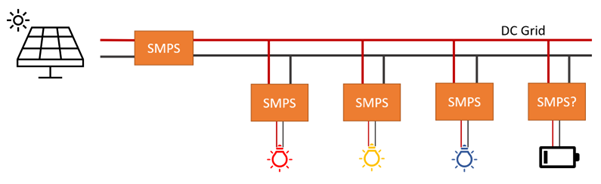
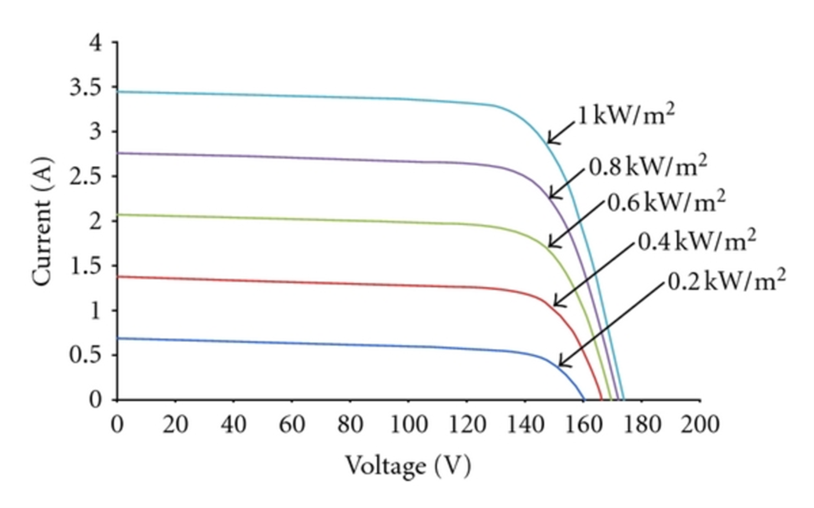

# EE2 Balancing Robot – Energy System

## High Level Task Description
In order to map the maze, your robot will need some fixed points of reference to figure out its location in the 2D space of the maze. These fixed points of reference will be the three LED beacons we have provided to you, they are 1W LEDs inside a ping pong ball (for diffusion and to prevent you all blinding yourselves) which you may place anywhere around the arena.
The Energy System task is to provide power to these beacons from a PV panel (or emulated panel). As PV systems are variable in their output, you will need to manage the supply and demand at all times to make sure your system stays working. This will mean that you must be able to maintain function through (short) periods of minimal PV output.

__Figure 1 - An example of how you may set up your Energy System__

## Main Circuit Components
You will be provided with the following major components along with other equipment for testing development. The various SMPS circuits are all variants of the EE lab SMPS so you will be able to do development on the SMPS you know and swap in the new boards as they arrive. You may need to work at different voltages during development but this should only require minor code updates when moving to new boards.
Please keep in mind during your development and testing that you are now making up your own tests and experiments for these circuits and components and therefore it is EXTREMELY IMPORTANT that you are careful of the ratings of your devices. If you damage anything it may well not be possible to replace it. Most of the equipment has long lead times and there are very few spares.
Most often equipment gets damaged by accidents with things like:

- PSU settings not being what you thought (overvolting equipment will often cause it to fail immediately. So always check your settings.
- PSU being on when you connect the equipment which can cause high inrush currents. It is often a good idea to start with the PSU current set low and build up after you turn it on.
- Short circuits, especially when you put the board down on top of something conductive or through messy wiring

Good practice for covering some of the most common failures:

- Keep your space tidy to avoid things getting shorted
- Keep your circuits neat, this will allow you to be certain that its wired up how you think and makes debugging easier and reduces chances of shorting
- Check your PSU voltage setting and current limit before connecting your circuit. Also check its output is off
- Be extra wary when working with devices like PV panels that can never truly be “off”

#### PV Panel (ready 22nd May)
- Open Circuit Voltage – 5V
- Short Circuit Current – 230mA
#### EE2 Lab SMPS (Blue, Black or Red PCB with screw terminals) (ready 22nd May)
- Voltage port A limits – 0 – 8V (refer to lab challenge if you want to know why)
- Voltage port B limits – 0 – 35V
- Current limit – 1 or 2A for red boards, more for black and blue
- Configurations – Buck/Boost/Bidirectional
- Current sensing – Bidirectional at positive terminal
- Controller – Arduino Nano Every
- Controller Power – USB only
- Language/IDE – Arduino IDE, Arduino Code
- Notes – Limited voltage on port A due to gate drive setup
#### EE2 Lab SMPS for next year (due in Week 2 June)
- Voltage port A limits – 0 – 35V
- Voltage port B limits – 0 – 35V
- Current limit – 5A
- Configurations – Buck/Boost/Bidirectional
- Current sensing – Bidirectional at positive terminal
- Controller – Raspberry Pi Pico W
- Controller Power – USB or from Port A or Port B (depending on switch position)
- Language/IDE – Thonny, Micropython
- Notes – None? I hope most issues are fixed
#### LED Driver (due 1st June)
- Voltage input limits – 7 – 35V
- Voltage output limits – 0 – 35V
- Current limit – 500mA or so
- Configurations – Buck (other configs may work but not tested and without current sense)
- Current sensing – Negative terminal, only for positive current
-	Controller – Raspberry Pi Pico W
-	Controller Power – USB or from input port
-	Language/IDE – Thonny, Micropython
-	Notes – Really intended as a buck, Pico is powered from input port hence min voltage
#### LED Beacons (ready in batches starting 23rd May)
-	Power – 1W
-	Voltage - ~3V
-	Current - ~300mA
-	Colours – Red, Blue and Yellow
#### Supercapacitor (ready 22/23rd May)
-	Voltage limits – 18V
-	Capacity – 0.25F
-	ESR - ~4ohms
-	Current limit - ~380mA 5s peak
-	More Info [DSM254Q018W075PB Cornell Dubilier - CDE | Mouser United Kingdom](https://www.mouser.co.uk/ProductDetail/Cornell-Dubilier-CDE/DSM254Q018W075PB?qs=rQFj71Wb1eXTUSitfenP%2Fw%3D%3D)

## PV System Initial Tests
Your system should be designed to be solar powered. Ideally you would do all of your development and testing (and the final demo) using real solar panels but the sun is not reliable and we don’t have one in the UG lab. For that reason you’ll be doing a lot of your development (and all your demo) using an emulation of a PV panel.
Whether the energy source is a real panel or an emulation you will need to do MPPT and manage the balance of supply (PV panels) and demand (your coloured beacons) throughout the demo.
The first thing you need to do is characterise so you can assess their capabilities and how that fits in with the rest of your design.

[TruOpto OPL50A23101 90x125x3mm Solar Module 5V 1.15W | Rapid Online](https://www.rapidonline.com/truopto-opl50a23101-90x125x3mm-solar-module-5v-1-15w-55-0016)

The link above has the “datasheet” for the solar panels in your kit. It has a rated voltage and current but no I-V curve so you will need to create one of your own. To achieve this you will be using the SMPS from the EE2 Power Electronics Lab and a set of fixed value resistors. As you have only fixed resistors you will use the SMPS and adjust the duty cycle to draw different currents from the panel and measure the output voltages and currents. Your kit includes a multimeter with a current clamp to take these measurements. You should expect this to look a bit like the ones below.

__Figure 2 - Typical I-V curves for a PV panel  (much larger than yours)__

Once you have characterised one panel, you can extrapolate (or test) what to expect from all 3 of your panels together in parallel. 

## Emulating a PV Panel
A very basic emulation can be achieved using a PSU with the voltage set to the open-circuit voltage and the current limit set to the short-circuit current. This would be a rectangle on the graph above so is clearly not ideal. Adding a resistor in series with the output gives you the slope on the right of the graph and adding one in parallel gives you the slope on the top of the graph. These resistors are optional but will give you a more accurate representation that may aid your development. You will need to specify these resistors, be aware of the power requirements whilst doing this!
## Using your LEDs from a PSU
Initially you will want to run your LED beacons from a PSU so that you can test the camera system whilst developing the Energy system. To achieve this, you should set your voltage to 3V and the current limit to a low value of approximately 100mA. Make sure the PSU is off, and connect the beacon. When you have turned it on you can bring up the current limit (and with it the brightness) to 300mA. If you wish to test the actual voltage drop of your LED (the above values are approximate) then you can bring up the voltage setting too, the PSU should go into current limited mode and show you the voltage drop. You can also use this method to plot the voltage drop at lower current levels.
