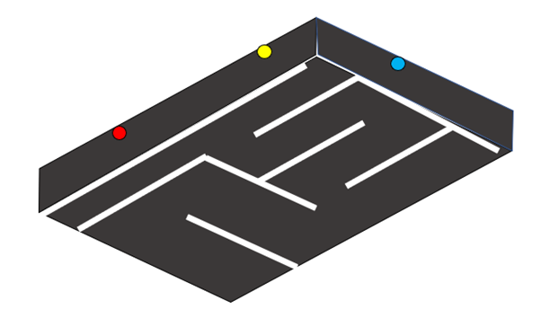
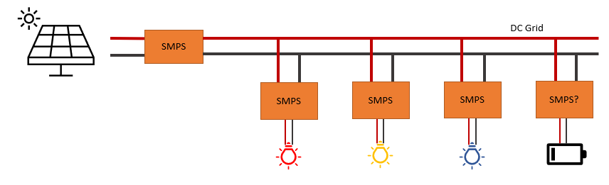

# ELEC50008 - Engineering Design Project 2
## Project Brief: Maze solving robot
## Introduction

The Engineering Design Project 2 is one of the six modules that make up your second year of study. It brings together theoretical and practical content from your lectures and labs with important industrial skills relating to product design, project management and team working.

You will work in tutorial groups of 6 (2 EEE and 4 EIE) people to complete the project. It will be assessed with an interim interview, a final report, and a demo.

## Brief

You are requested to design and build a balancing robot (segway) that can autonomously map and navigate a maze. A prototype of the design must be built and tested in the artificial maze in the lab. The maze is laid out with light strips on an arena. The arena is coloured black and surrounded by black curtains.

## Requirements

### Functional requirements
The system must:
1. Autonomously move through a maze without crossing an illuminated line
2. Autonomously survey the layout of the maze and produce a map of the discovered layout, overlaid with the position of the robot and the shortest path through the maze
3. Balance on two wheels

### Non-functional requirements
The system must be:
1. Reliable and able to complete its task without human intervention
2. Robustly and efficiently constructed
3. Coded for:
   a. Usability
   b. Testability
   c. Maintainability
   d. Scalability

### Implementation restrictions
1. The permitted means of locating the robot within the maze are:
   a. Dead-reckoning based on accelerometer, gyroscope and wheel revolution counting
   b. Optical detection of the maze markings and up to three illuminated beacons by the robot
2. Illuminated beacons shall be powered by a specified PV-array emulator and provided energy conversion modules
3. The robot will use the provided FPGA-based camera system

## Beacons

Students can place illuminated beacons around the edge of the arena to use as visual datum points for mapping the arena. The beacons are powered by a solar energy system and students must manage their energy budget to support robot navigation under varying power availability.

The emulated power availability will vary over the order of seconds, limiting the stored energy requirement. Storage will principally be capacitors, but flywheel or gravity-based energy storage is a possibility. Batteries will not be used in the beacon system.
The power system will have a centralised controller that can interface with the other project components.

## System design

The solution will typically comprise of several subsystems:

1.	Robot mechanics and dynamic control
2.	Robot vision
3.	Beacon management
4.	Navigation, command and user interface

The solutions for the above given challenges should be and solved with teamwork

## Deliverables and Assessments

The project will be assessed with an interim interview, a final report and a 10-min demonstration in the arena.

### Interim Presentation
**Date of assessment:  1 June 2023**

The interim presentation is an opportunity to show your progress mid-way through the project. You should prepare a presentation showing your high-level design, research and technical progress so far. You should also present a plan, e.g. Gantt chart, for the remaining task to complete the project.

Marks weighting: 20%

**Reflections on professional practice (once per week)** | **5%**

### Report
**Date of assessment:  20 June 2023**

The report is a formal documentation of all the technical and non-technical work you have done on the project. The report should justify all your design decisions and include test results of various aspects of your prototype. One team member should act as overall editor to ensure that the report is consistent in style and content.

Marks weighting: 35%

### Demo
**Date of assessment:  23 June 2023**

The demo is your opportunity to present your completed project. There are two parts to the demo:
1.	An assessment of your segway on the lab bench, where your examiner will ask to see different functional aspects and assess your theoretical understanding of the implementation.
2.	A test of your segway on the demonstration arena, where (DO EXPLAIN ARENA).

Marks weighting: 40%

## Getting started
### Balancing Robot (EEESegway) Kit

Your EEESegway has been designed to support modification for work on this project. You will be using a microcontroller platform with a WiFi module (ESP32), you can continue to develop code using the Arduino framework and IDE.
The central PCB has connections for a motor driver module, which will simplify the challenge of steering and reversing your rover.

#### Robot Hardware

-	FPGA board (FPGA Max DE-10 lite)
-	Camera Module (D8M)
-	WiFi microcontroller (ESP32)
-	NiMH Battery Pack
-	Inertial measurement unit (MPU6050)
-	Stepper motors and drivers (NEMA-17 Stepper motors and A4988 Stepper Motor Drivers)
-	Breadboard and Various of Components in the Lab

#### Connection and Structural Elements 

-	3D printed chassis and mounting sockets, parts.
-	Screws, nuts, spacers

			
### Construction
Mechanical design is not a core component of the EEE/EIE degree so it is left to you to be innovative in the construction of your segway.
The given chassis is designed to be a useful platform but feel free to modify it, taking into account the budget and weight constraints.
			
You can download a computer-aided manufacturing (CAM) drawing of the chassis, which can be modified for reproduction in acrylic with a laser cutter.
Workshop facilities are available on arrangement with the lab technicians.
You may wish to consider 3D printing, though you will need to research and teach yourself the necessary techniques first.
3D printers are available to use with the help of the lab technicians.	

### New Skills

-	Project Management
-	Complex System Engineering
-	Top-Down Approach
-	Documentation
-	Group Work
-	Problem Solving

### Marking Scheme

| Component   | Weight	 | High Mark |  Middle Mark | Low Mark |
| ------------- | ------------- | ------------- | ------------- | ------------- | 
| **Interim Presentation** | **20%**  |    |   |    |
| Design progress |30%|Logical division of the problem into submodules. Optimal design decisions made by evaluating alternatives against specifications.  | Design decisions made but poorly justified. | Basic system design with ill-considered choice of submodules |
| Implementation progress | 30%  | Progress demonstrated on all submodules, including circuit diagrams, simulations, test results, photographs and videos. Preliminary integration of submodules | Some successful implementation. Little or no integration of subsystems. | Little or weak evidence of progress |
| Planning |  15% | Work so far addresses all major uncertainties and risk areas. Realistic schedule for remaining work. | Main challenges identified and work underway to address them. Remaining work identified.  | Significant uncertainties remain. Unrealistic or superficial plan for remaining work. |
| Teamworking | 15%  | Work so far a joint effort from all group members. Allocation of work provides contingency for technical challenges. Cooperation on system design and interfaces between submodules  |  | Uneven split between group members. Little coordination on system design  |
| **Reflections on professional practice (once per week)** | **5%**  |   |  |  |
| **Project Report (20/06/23)**	  | **35%**   |  |  |  |
| System Design  | 30%  | Top-level requirements refined by exploring the problem space. Definition of quantitative specifications. Division of problem into submodules. Requirements and interfaces defined for all submodules. |  | Vague or incomplete specifications. Weak system-level design |
| Implementation |  30% | High-quality technical solutions for all elements of the project. Consideration of alternatives and justification for design decisions. Unambiguous documentation of the solution. |  | Some design elements not documented, even if they work correctly. Doubts over referencing of research material |
| Results | 25%  | High-quality evidence that solution meets all requirements at both subsystem level and top level. Appropriate tests designed. |  | Testing incomplete or not relevant to specifications. Doubts over accuracy of results |
| Teamworking | 15%  | Documentation of group member contributions to the project. Integrated report with consistent style and formatting. |  | Sections from different authors compiled with little overall editing. Basic content on system-level design and implementation |
| **Interview and Demo (23/06/23)** | **40%**  |  |  |  |
| Performance |  15% | BalanceBug completes demo task quickly and accurately. |  | BalanceBug fails to complete demonstration |
| Design Quality| 35%  | Implementation meets non-functional requirements. Innovative design and robust, professional implementation that demonstrates technical skill. |  | Implementation hampered by poor construction quality or dubious design decisions |
| Technical understanding  | 35%  | All technical questions answered accurately, showing complete understanding of the design challenges and solution. |  | Some aspects of the implementation cannot be explained |
| Teamworking | 15%  | Evidence of group members working together to complete project. Individuals demonstrate different areas of expertise in the project. |  | Contribution of some team members unclear. Technical understanding concentrated in a small number of group members |

